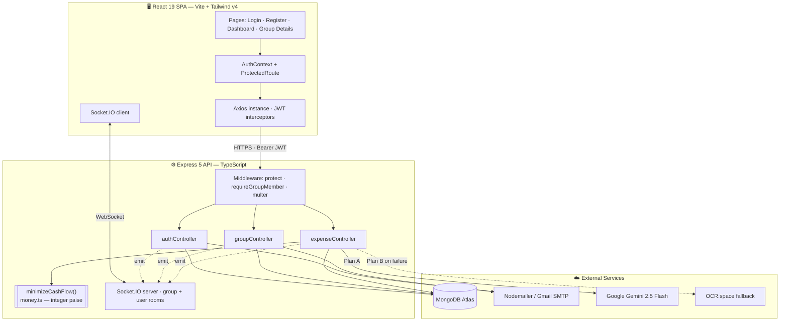
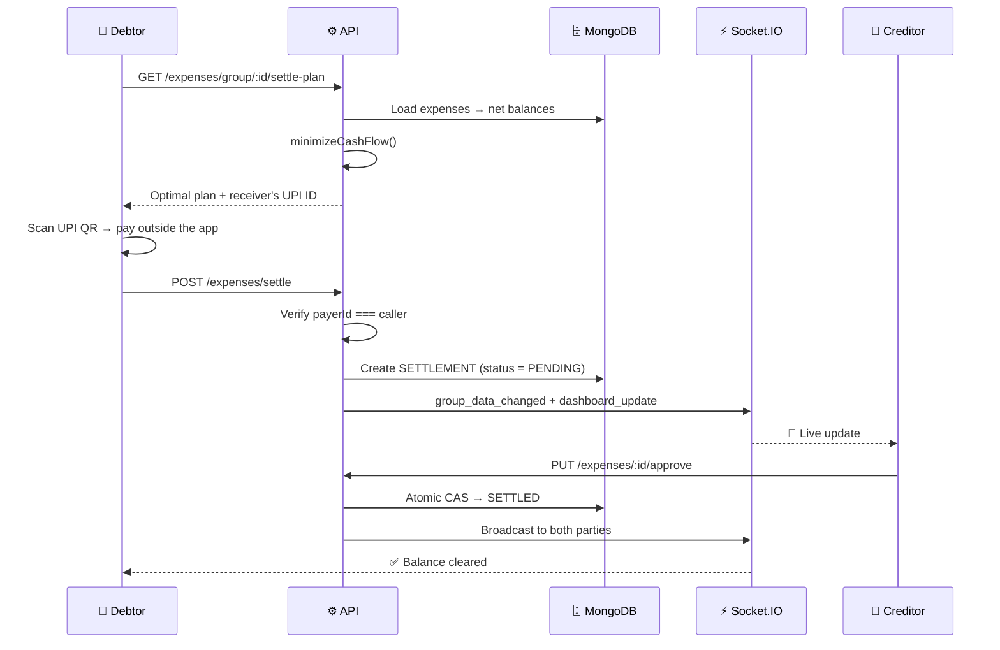
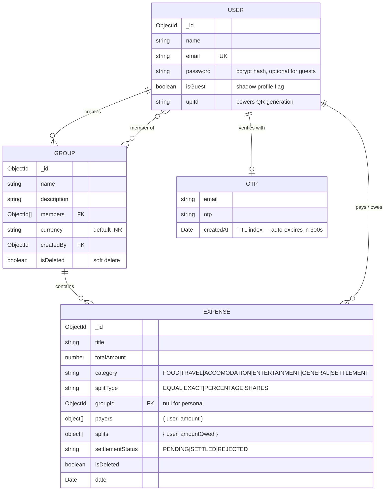

<div align="center">

# 💸 SmartSplit — Expense Splitter

**Split group expenses, settle debts in the fewest possible payments, and pay with a single UPI scan.**

A full-stack MERN application with real-time sync, AI receipt scanning, email-OTP authentication,
and a financial ledger built on integer arithmetic — so the numbers always add up to the last paisa.

[](https://expense-splitter-frontend-mqg9.onrender.com)
[](https://expense-splitter-wenb.onrender.com)


🔗 **Live App:** https://expense-splitter-frontend-mqg9.onrender.com &nbsp;·&nbsp; **API:** https://expense-splitter-wenb.onrender.com

</div>

---

## 📖 Table of Contents

- [The Problem](#-the-problem)
- [Feature Highlights](#-feature-highlights)
- [Engineering Highlights](#-engineering-highlights)
- [Architecture](#-architecture)
- [Tech Stack](#-tech-stack)
- [Data Model](#-data-model)
- [API Reference](#-api-reference)
- [Real-Time Events](#-real-time-events)
- [Getting Started](#-getting-started)
- [Environment Variables](#-environment-variables)
- [Project Structure](#-project-structure)
- [Deployment](#-deployment)
- [Roadmap](#-roadmap)
- [Author](#-author)

---

## 🎯 The Problem

Six friends go on a trip. One pays for the hotel, another for cabs, a third for dinner — split three
different ways, some of it unequally. By day four nobody knows who owes whom, and settling it means
fifteen awkward UPI transfers.

**SmartSplit fixes this in three ways:**

1. **Track anything** — multiple payers on a single bill, equal / exact / percentage splits, receipts scanned by AI.
2. **Simplify the debt** — a greedy cash-flow-minimization algorithm collapses N×N tangled debts into the smallest possible set of payments.
3. **Settle for real** — tap to pay, scan the receiver's auto-generated UPI QR, and the receiver approves the payment before the ledger moves.

---

## ✨ Feature Highlights

### 🔐 Authentication & Onboarding
| Feature | Details |
|---|---|
| **Email OTP verification** | 6-digit code delivered via Nodemailer, auto-expiring after 5 minutes through a MongoDB TTL index — no cron job, no cleanup task. |
| **JWT sessions** | 7-day signed tokens, attached automatically by an Axios request interceptor; a response interceptor clears the session on any `401`. |
| **Password security** | bcrypt hashing with per-user salts; passwords are never returned by any endpoint. |
| **Shadow-profile claiming** ⭐ | Add a friend to a group before they've ever signed up. A **guest user** is created instantly so their expenses are tracked from day one. When they later register with that email, the account is *claimed* — every trip, expense and balance is already waiting for them. Nothing is lost, nothing is re-entered. |

### 👥 Groups & Expenses
- **Group ledgers** with members, currency, soft-delete and creator-only permissions.
- **Multi-payer expenses** — "Aman paid ₹600, Riya paid ₹400" on the same ₹1000 bill.
- **Three split modes** — `EQUAL`, `EXACT` (rupee amounts), `PERCENTAGE`, validated on **both** client and server.
- **Categories** — Food, Travel, Accommodation, Entertainment, General, Settlement.
- **Email invites** — new members get a branded invite mail with a signup nudge (fire-and-forget, so a mail outage never blocks the request).
- **Safe group deletion** — the API recomputes every balance and refuses to delete a group while anyone is still owed money.

### 🤖 AI Receipt Scanner
Snap a photo of a bill and the merchant name + total are extracted and pre-filled into the expense form.

- **Plan A — Google Gemini 2.5 Flash** for structured vision extraction (`{ title, amount }`).
- **Plan B — automatic OCR fallback** (OCR.space + regex heuristics) if the AI key is missing, rate-limited, or returns malformed JSON.
- Uploads are capped at **5 MB** and held in memory only — nothing touches disk.

The user never sees a failure mode; the graceful degradation is invisible.

### 💳 Settlements That Actually Settle
- **Optimal settlement plan** — the fewest transactions that clear the entire group.
- **UPI QR generation** — each debt renders a scannable `upi://pay` deep-link QR pre-filled with the payee's VPA, name and exact amount. Scan → pay → done.
- **Two-phase confirmation** — a settlement is created as `PENDING` and only affects balances once the **receiver** approves it. Rejection is one tap away.
- **Fraud-resistant** — you can only record a settlement *you* paid, and only the receiver can approve or reject it.

### ⚡ Real-Time Everything
Socket.IO rooms per group *and* per user. When anyone adds an expense, joins a group, or approves a
settlement, every other participant's dashboard and ledger update **instantly** — no refresh, no polling.

---

## 🧠 Engineering Highlights

> The parts of this project I'd want to talk through in an interview.

### 1. Money is never a float

`0.1 + 0.2 !== 0.3` — and in a ledger, that drift compounds until balances stop reconciling.
All arithmetic happens in **integer paise** and converts back to rupees only at the API boundary.

```ts
// backEnd/src/utils/money.ts
export const toPaise  = (amount: number): number => Math.round(Number(amount) * 100);
export const toRupees = (paise: number): number  => paise / 100;
```

### 2. Equal splits that are provably zero-sum

Splitting ₹100 three ways naively gives `33.33 × 3 = 99.99` — a paisa vanishes from the ledger on
every single expense. The remainder is distributed deterministically instead:

```ts
const base      = Math.floor(totalPaise / splits.length);        // 3333
const remainder = totalPaise - base * splits.length;             // 1
splitsPaise = splits.map((_, i) => base + (i < remainder ? 1 : 0)); // 3334, 3333, 3333 ✅
```

Every expense is validated to be **zero-sum before it is persisted**: payers must sum to the total,
splits must sum to the total. Percentage splits are allowed to absorb a few paise of rounding drift;
anything larger is rejected with a `400`.

### 3. Debt simplification (greedy cash-flow minimization)

Rather than storing "who owes whom" pairwise, the server derives a **net balance per person** from
the full expense history, then greedily matches the largest debtor against the largest creditor.

```
Raw debts (5 payments)        Net balances        Optimized plan (2 payments)
  A → B  ₹300                   A  −₹200            B → C  ₹300
  A → C  ₹200            →      B  −₹300      →     A → C  ₹200
  B → C  ₹400                   C  +₹500
  C → A  ₹100
  B → A  ₹200
```

`O(n log n)` to sort, `O(n)` to match — each iteration fully settles at least one person, so at most
`n − 1` transactions result. Implemented in [`minimizeTransactions.ts`](backEnd/src/utils/minimizeTransactions.ts),
with settle-and-deduct using the *same* rounded value so the emitted transactions can never drift
away from the underlying balances.

### 4. Race-safe settlement approval

A read-then-save approval would let two concurrent taps both succeed and double-credit the ledger.
Approval is a single **atomic compare-and-swap** — find, authorize and flip in one database round trip:

```ts
const settlement = await Expense.findOneAndUpdate(
  { _id: settlementId, category: 'SETTLEMENT', settlementStatus: 'PENDING', 'splits.0.user': req.user.id },
  { $set: { settlementStatus: 'SETTLED', title: "Settlement Completed" } },
  { new: true }
);
if (!settlement) return res.status(409).json({ message: "Already processed, or not yours to approve" });
```

The query doubles as the authorization check: `'splits.0.user': req.user.id` means only the *receiver*
can ever match the document.

### 5. Defense in depth on authorization

- `protect` — verifies the JWT and hydrates `req.user`; `next()` deliberately sits **outside** the
  `try` block so a downstream error can't be misreported as a bad token (which previously sent a
  second response and crashed the process).
- `requireGroupMember` — blocks any request touching a group the caller isn't a member of. Without it,
  any authenticated user could read or write any group's ledger just by guessing an ObjectId. It reads
  the group id from either the URL params or the body, and lets genuinely personal (group-less)
  expenses pass through.
- A malformed ObjectId is caught and answered with `400`, not a 500 stack trace.

### 6. Soft deletes everywhere

Groups and expenses are never destroyed — `isDeleted` flags preserve the full financial audit trail
while hiding them from every query. Historical balances stay reconstructable.

---

## 🏗 Architecture



### Settlement lifecycle



---

## 🛠 Tech Stack

<table>
<tr><td valign="top" width="50%">

**Frontend**
- React 19 + TypeScript
- Vite 8 (build & dev server)
- Tailwind CSS v4 (`@tailwindcss/vite`)
- React Router 7
- Axios (interceptor-based auth)
- Socket.IO client
- `qrcode.react` — UPI deep-link QR
- `lucide-react` — icons
- ESLint 10 + typescript-eslint

</td><td valign="top" width="50%">

**Backend**
- Node.js + Express 5 + TypeScript
- MongoDB Atlas + Mongoose 9
- Socket.IO (rooms & broadcasts)
- JSON Web Tokens + bcryptjs
- Nodemailer (OTP + invite mail)
- Multer (in-memory uploads, 5 MB cap)
- `@google/genai` — Gemini 2.5 Flash
- Axios + form-data — OCR fallback
- dotenv · cors

</td></tr>
</table>

---

## 🗄 Data Model



**Why one collection for expenses and settlements?** A settlement *is* just an expense that moves
money the other way (`category: 'SETTLEMENT'`). One ledger, one balance computation, no reconciliation
between two sources of truth.

---

## 📡 API Reference

Base URL: `/api` · All protected routes require `Authorization: Bearer <token>`

### Auth — `/api/auth`
| Method | Endpoint | Auth | Description |
|---|---|:--:|---|
| `POST` | `/send-otp` | — | Email a 6-digit OTP (rejects already-registered non-guest emails) |
| `POST` | `/verify-otp` | — | Verify OTP → register **or claim a shadow profile** → returns JWT |
| `POST` | `/login` | — | Email + password → JWT (guests are redirected to sign-up) |
| `GET` | `/profile` | 🔒 | Current user, password excluded |
| `PUT` | `/update-upi` | 🔒 | Save the UPI ID used for QR generation |

### Groups — `/api/groups`
| Method | Endpoint | Auth | Description |
|---|---|:--:|---|
| `POST` | `/create` | 🔒 | Create a group (creator auto-added, members de-duplicated) |
| `GET` | `/my-groups` | 🔒 | All active groups for the user, newest activity first |
| `PUT` | `/:groupId/add-member` | 🔒 | Add by email — creates a guest profile if they aren't registered, and mails an invite |
| `DELETE` | `/:groupId` | 🔒 | Creator-only soft delete; **blocked while any balance is outstanding** |

### Expenses — `/api/expenses`
| Method | Endpoint | Auth | Description |
|---|---|:--:|---|
| `POST` | `/add` | 🔒 + 👥 | Create an expense; validates zero-sum payers & splits in paise |
| `GET` | `/my-expenses` | 🔒 | Every expense the user paid, owes, or created |
| `GET` | `/group/:groupId` | 🔒 + 👥 | Full group ledger, populated & sorted |
| `GET` | `/dashboard` | 🔒 | Net summary: *you are owed* / *you owe* / per-friend balances |
| `GET` | `/group/:groupId/settle-plan` | 🔒 + 👥 | **Minimized** settlement plan incl. payee UPI IDs |
| `POST` | `/settle` | 🔒 + 👥 | Record a payment you made → `PENDING` |
| `PUT` | `/:settlementId/approve` | 🔒 | Receiver-only atomic approval → `SETTLED` |
| `PUT` | `/:settlementId/reject` | 🔒 | Receiver-only atomic rejection → `REJECTED` |
| `POST` | `/parse-receipt` | 🔒 | Multipart image → `{ title, amount }` via Gemini, OCR fallback |

🔒 = JWT required &nbsp;·&nbsp; 👥 = group membership enforced

<details>
<summary><b>Example — create a multi-payer, percentage-split expense</b></summary>

```http
POST /api/expenses/add
Authorization: Bearer <token>
Content-Type: application/json

{
  "title": "Goa Beach Resort",
  "totalAmount": 12000,
  "groupId": "65f1a2b3c4d5e6f7a8b9c0d1",
  "splitType": "PERCENTAGE",
  "payers": [
    { "user": "65f1...aaa", "amount": 8000 },
    { "user": "65f1...bbb", "amount": 4000 }
  ],
  "splits": [
    { "user": "65f1...aaa", "amountOwed": 4800 },
    { "user": "65f1...bbb", "amountOwed": 4800 },
    { "user": "65f1...ccc", "amountOwed": 2400 }
  ]
}
```

```jsonc
// 201 Created
{ "message": "Expense added", "expense": { /* … */ } }

// 400 — the ledger stays zero-sum or the write is rejected
{ "message": "Payer amounts must add up to the total amount" }
```
</details>

---

## ⚡ Real-Time Events

| Event | Direction | Purpose |
|---|---|---|
| `join_group` | client → server | Subscribe to a group's room (`groupId`) |
| `join_user_room` | client → server | Subscribe to personal notifications (`userId`) |
| `group_data_changed` | server → clients | Ledger changed — refetch expenses & settle plan |
| `dashboard_update` | server → clients | A balance moved — refresh dashboard totals |

Every mutating controller broadcasts to **both** the group room and each affected member's personal
room, so a change is reflected on the group page *and* on the dashboards of people who aren't
currently looking at that group.

---

## 🚀 Getting Started

### Prerequisites
- **Node.js** 18+ and npm
- A **MongoDB** connection string (Atlas or local)
- A **Gmail app password** for OTP mail — [how to create one](https://support.google.com/accounts/answer/185833)
- *(Optional)* a **Google Gemini API key** — without it, receipt scanning silently falls back to OCR

### 1. Clone

```bash
git clone https://github.com/Amankumar-033/Expense-Splitter.git
cd Expense-Splitter
```

### 2. Backend

```bash
cd backEnd
npm install
# create .env — see the table below
npm run dev          # ts-node-dev with hot reload → http://localhost:5000
```

### 3. Frontend

```bash
cd frontEnd
npm install
# create .env with VITE_API_URL=http://localhost:5000/api
npm run dev          # Vite dev server → http://localhost:5173
```

> ⚠️ Set `FRONTEND_URL=http://localhost:5173` in the backend `.env` — CORS **and** the Socket.IO
> handshake are both locked to that exact origin.

### Scripts

| Location | Command | Description |
|---|---|---|
| `backEnd` | `npm run dev` | Hot-reloading dev server (`ts-node-dev`) |
| `backEnd` | `npm start` | Run directly from TypeScript (`ts-node`) |
| `frontEnd` | `npm run dev` | Vite dev server with HMR |
| `frontEnd` | `npm run build` | Production bundle → `dist/` |
| `frontEnd` | `npm run preview` | Serve the production build locally |
| `frontEnd` | `npm run lint` | ESLint across the app |

---

## 🔑 Environment Variables

### `backEnd/.env`
| Variable | Required | Description |
|---|:--:|---|
| `PORT` | — | API port (defaults to `5000`) |
| `MONGO_URI` | ✅ | MongoDB connection string — the server exits on startup without it |
| `JWT_SECRET` | ✅ | Signing secret for 7-day session tokens |
| `EMAIL_USER` | ✅ | Gmail address that sends OTP & invite mail |
| `EMAIL_PASS` | ✅ | Gmail **app password** (not your account password) |
| `FRONTEND_URL` | ✅ | Exact origin allowed by CORS and the Socket.IO handshake |
| `GEMINI_API_KEY` | ➖ | Enables AI receipt parsing; omit to use the OCR fallback |

### `frontEnd/.env`
| Variable | Required | Description |
|---|:--:|---|
| `VITE_API_URL` | ✅ | API base URL including `/api`. The Socket.IO URL is derived from it by stripping the suffix — one URL to configure, not two. |

> 🔒 Both `.env` files are git-ignored. Never commit real credentials.

---

## 📂 Project Structure

```
Expense-Splitter/
├── backEnd/
│   ├── src/
│   │   ├── controllers/
│   │   │   ├── authController.ts       # OTP, login, shadow-profile claiming, UPI
│   │   │   ├── groupController.ts      # CRUD + guest creation + balance-guarded delete
│   │   │   └── expenseController.ts    # Ledger, dashboard, settlements, AI receipts
│   │   ├── middleware/
│   │   │   ├── authMiddleware.ts       # JWT verification → req.user
│   │   │   └── groupMiddleware.ts      # Group-membership authorization
│   │   ├── models/                     # User · Group · Expense · OTP (TTL)
│   │   ├── routes/                     # auth · groups · expenses
│   │   ├── utils/
│   │   │   ├── minimizeTransactions.ts # ⭐ Greedy debt simplification
│   │   │   ├── money.ts                # ⭐ Integer-paise arithmetic
│   │   │   └── sendEmail.ts            # OTP + branded invite templates
│   │   └── index.ts                    # Express + HTTP + Socket.IO bootstrap
│   └── tsconfig.json                   # strict: true
│
└── frontEnd/
    ├── src/
    │   ├── api/                        # Axios instance + socket URL derivation
    │   ├── components/
    │   │   ├── AddExpenseModal.tsx     # Multi-payer, 3 split modes, AI scan
    │   │   ├── SettleUpSection.tsx     # Settlement plan + UPI QR
    │   │   ├── GroupLedger.tsx         # History + approve / reject
    │   │   ├── AddMemberModal.tsx · DeleteGroupModal.tsx · ProtectedRoute.tsx
    │   ├── context/AuthContext.tsx
    │   ├── pages/                      # Login · Register · Dashboard · GroupDetails
    │   └── main.tsx · App.tsx
    └── vite.config.ts
```

---

## 🌐 Deployment

Both services run on **Render**, backed by **MongoDB Atlas**.

| Service | Type | Notes |
|---|---|---|
| **Frontend** | Static Site | `npm run build` → publish `dist/`. Set `VITE_API_URL` **at build time** — Vite inlines it into the bundle. |
| **Backend** | Web Service | `npm install` → `npm start`. Runs TypeScript directly via `ts-node`. |
| **Database** | MongoDB Atlas | Whitelist Render's egress IPs (or `0.0.0.0/0` for a free tier). |

**Deployment notes worth knowing:**
- CORS and the Socket.IO handshake share **one config object** — a mismatched `FRONTEND_URL` breaks
  live updates while REST keeps working, which is a genuinely confusing failure mode.
- The server listens via `httpServer.listen()`, **not** `app.listen()` — otherwise Socket.IO never
  attaches to the HTTP server.
- Render's free tier sleeps after inactivity; the first request may take ~30 seconds to wake.

---

## 🗺 Roadmap

- [ ] Automated test suite — unit tests for `minimizeCashFlow` and the paise arithmetic first
- [ ] `SHARES` split mode (already modelled in the schema, not yet in the UI)
- [ ] Multi-currency groups with live FX conversion (the `currency` field is in place)
- [ ] Expense edit & delete with full audit history
- [ ] Rate limiting on OTP requests and receipt uploads
- [ ] Refresh tokens + httpOnly cookie sessions
- [ ] Push notifications for pending settlement approvals
- [ ] CSV / PDF export of a group ledger
- [ ] PWA offline support

---

## 👤 Author

**Aman Kumar**

[](https://github.com/Amankumar-033)

---

<div align="center">

**Built to be correct to the last paisa.**

If this project was useful or interesting, a ⭐ on the repo is much appreciated.

</div>
